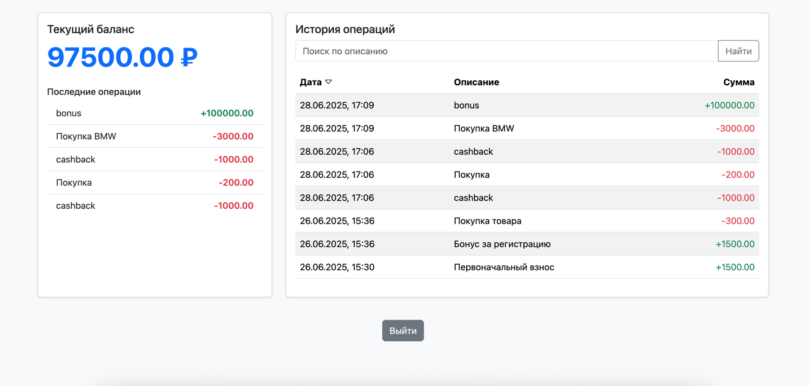

# 💼 Пользовательский баланс и история операций

Приложение на Vue 3 + Laravel для отображения баланса и истории транзакций.

## ⚙️ Установка

```bash
composer install
npm install
cp .env.example .env
php artisan key:generate
php artisan migrate

# Создаём тестового пользователя
php artisan user:create testuser password

# Добавляем три транзакции
php artisan balance:operate testuser "Пополнение счёта" --amount=5000
php artisan balance:operate testuser "Оплата подписки" --amount=-1000
php artisan balance:operate testuser "Кэшбэк" --amount=200

# Запускаем фронтенд и сервер
npm run dev
php artisan serve
